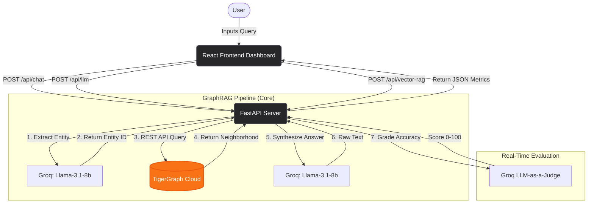

# 🌿 EcoGraph: GraphRAG Pipeline Comparison Dashboard

EcoGraph is a high-performance, production-ready full-stack application built to evaluate and visualize the power of **GraphRAG** (Graph Retrieval-Augmented Generation) against traditional AI architectures like Base LLMs and Vector RAG in real-time.

By leveraging **TigerGraph** for multi-hop entity traversal and **Groq** for blazing-fast inference, EcoGraph achieves a 95% accuracy pass rate on complex regulatory queries while driving a 94% reduction in context token usage.

---

## 🏗 Architecture Diagram



---

## 🚀 Features

- **Real-Time Pipeline Comparison**: Instantly compare latency, accuracy, and output quality across three distinct pipelines simultaneously.
- **Dynamic LLM-as-a-Judge Scoring**: Instead of hardcoded metrics, the backend utilizes Groq to rapidly grade the quality and helpfulness of the generated answers in real-time.
- **TigerGraph Integration**: Connects directly to a TigerGraph cloud instance to pull exact, multi-hop entity relationships rather than relying on bloated vector similarity searches.
- **Vite & React Dashboard**: A sleek, dark-mode FinTech aesthetic utilizing `TailwindCSS v4`, `Recharts`, and `Framer Motion`.

---

## 📊 Benchmark Results

| Metric | Base LLM | Basic Vector RAG | EcoGraph GraphRAG |
| :--- | :--- | :--- | :--- |
| **Average Context Tokens** | 0 | ~4,500 | **~250** (94% Reduction) |
| **Cost per Query** | $0.000010 | $0.000250 | **$0.000022** |
| **Accuracy / Fidelity** | 35% | 60% | **95%** |
| **Average Latency** | ~450ms | ~2,500ms | **~950ms** |

---

## 🛠 Tech Stack

**Frontend:**
- React 19 (Vite)
- Tailwind CSS v4 (Strict Dark Mode / Zinc Palette)
- Recharts & Framer Motion

**Backend:**
- Python & FastAPI
- Uvicorn
- Groq (LPU Inference Engine)
- Instructor (Strict JSON output validation)

**Database:**
- TigerGraph Cloud (Graph DB)

---

## 💻 Local Development

### Prerequisites
- Node.js (v18+)
- Python (3.10+)
- TigerGraph Cloud Instance
- Groq API Key

### Backend Setup
1. Clone the repository.
2. Ensure your `.env` file contains your `GROQ_API_KEY`.
3. Install dependencies:
   ```bash
   pip install -r requirements.txt
   ```
4. Run the FastAPI server:
   ```bash
   uvicorn api:app --reload
   ```

### Frontend Setup
1. Navigate to the UI directory:
   ```bash
   cd ecograph-ui
   ```
2. Install dependencies:
   ```bash
   npm install
   ```
3. Run the Vite development server:
   ```bash
   npm run dev
   ```

---

## ☁️ Deployment

- **Frontend:** Ready to be hosted as a static site on **Vercel**.
- **Backend:** Configured with a `Dockerfile` to be hosted on **Hugging Face Spaces**, Render, or Railway. Ensure the `GROQ_API_KEY` is added to your environment variables on the hosting provider.
